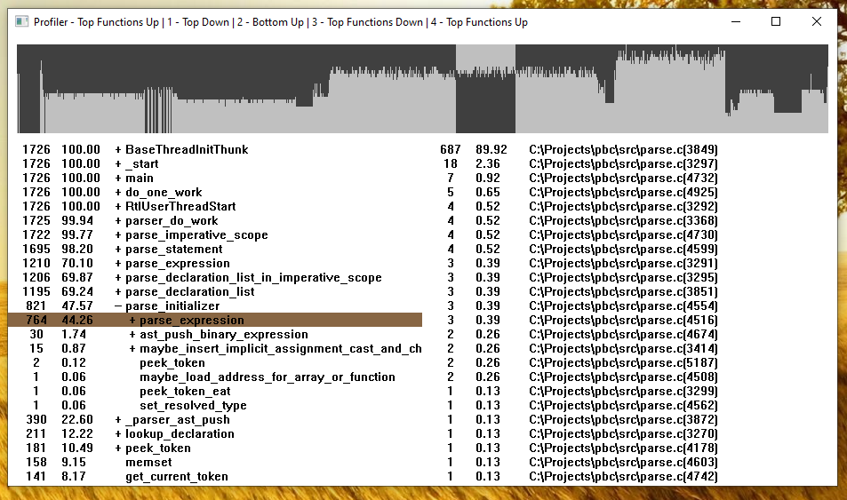

# Profiler

This is a _fairly_ simple sampling profiler based on the Event Tracing for Windows (ETW)
and DbgHelp APIs. The basic idea is to use ETW to generate stack trace samples,
symbolize them using DbgHelp, and use them to build profile trees.
These profile trees are then displayed using the GDI (essentially `FillRect` + `TextOut`).

<p align="center">
   
</p>

The left hand side shows the amount of samples raw and in percent, as well as the profiling tree.
The right hand side shows the lines hit for the selected function. 
There are four trees generated:
* Top Down  
       Stack traces start from the sample location and end at the root (e.g `main()`).
* Bottom Up  
       Stack traces start from the root (e.g `main()`) and end at the sample location.
* Top Functions Down  
       Stack traces start from every possible location inside the stack trace and 
       end at the root (e.g `main()`).
* Top Function Up   
       Stack traces start from every possible location inside the stack trace and 
       end at the sample location.

These might seem somewhat cryptic from their description, but they make sense when you try them.

The code tries to be as _flat_ as possible; not a lot of utility functions, no wrappers, etc.
The only "non-required" complication is the use of a background thread to generate the 
profile trees.


# Usage

The command-line usage is as follows:

```
profiler <command> <arg1> <arg2>...
```
(e.g `profiler main.exe -argument`).

The profiler will get the raw command line and strip everything until the first space.
This means it expects the first parameter (`profiler`) to not contain a space 
(for example to be in your `PATH`).

# Limitations

The profiler is using ETW. ETW is intended to be used for whole system profiling (including kernel), hence
it requires administrator privileges.

The profiler only samples events from the process it initially creates and does not 
sample any children. This also means the profiler does not work with wrapper batch scripts.

The profiler is dumb about pretty much everything and DbgHelp is not really a fast API. 
Therefore, the profiler is not the fastest at generating the profiling trees.

# Build 

To build simply use `cl` from a [x64 Native Tools Command Prompt](https://learn.microsoft.com/en-us/cpp/build/building-on-the-command-line), e.g:
```
cl /O2 profiler.c
```
Because ETW requires administrator privileges, it can be advantageous to embed a 'requireAdministrator'
manifest into the executable. That way it will cause a UAC prompt, when you use it from a user command prompt.
The command to accomplish this is:
```
cl /O2 profiler.c /link /MANIFESTUAC:level='requireAdministrator' /MANIFEST:EMBED
```


